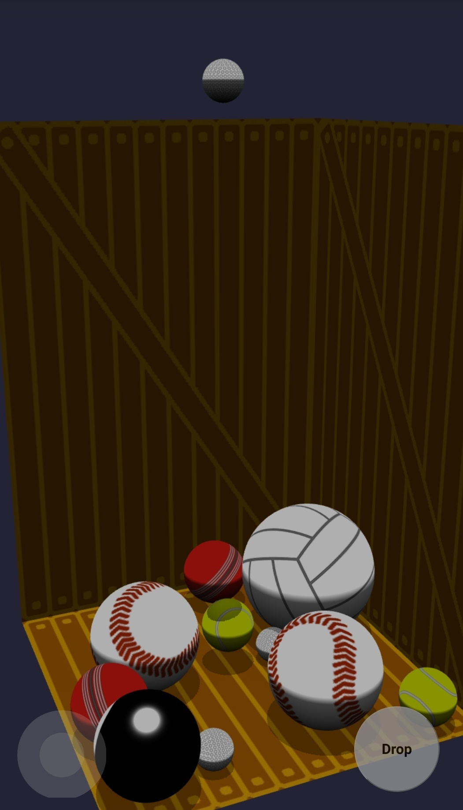

# Merge-Balls

Drop balls into the crate, merge balls of the same type and try to get the Beachball. [Play here!](https://mergeballs.netlify.app/)

WASD to move the top ball, space bar to drop. Click and drag to rotate. If there's no keyboard, the onscreen joystick can move the top ball.

Made with [BabylonJS](https://babylonjs.com/). Ball images from [Geometry of sports balls](https://paulbourke.net/geometry/spherical/) and [Texture Maps for Balls!](https://www.robinwood.com/Catalog/FreeStuff/Textures/TexturePages/BallMaps.html)

